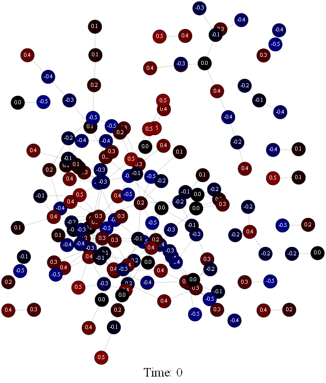
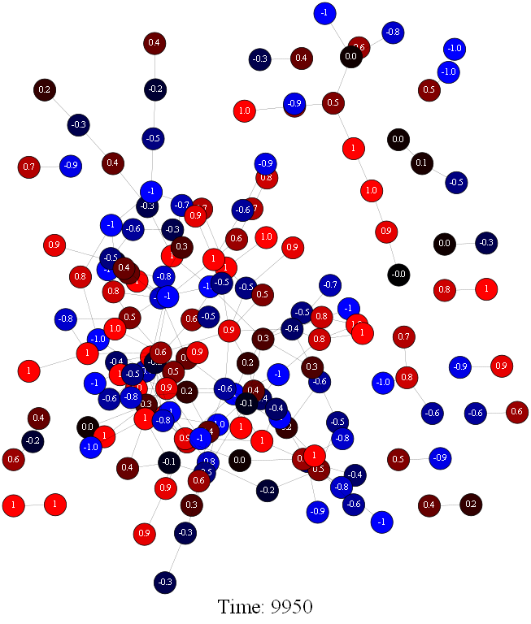

# IdeaPolarizationSimulator

## Project Overview

This program will simulate the spread of polarized or oppositional ideas through a population based on the [Polarizing Independent Cascade (PIC) algorithm](https://computationalsocialnetworks.springeropen.com/articles/10.1186/s40649-019-0076-z#Sec8). I used [ego networks built from Facebook user data](https://snap.stanford.edu/data/ego-Facebook.html) to represent the population. 

`generate_graphs.py` runs the simulation and saves a graph image for each timestep to the specified directory. 

`animate_graph_images.py` uses pygame to animate the graph images and show the progression of polarization over the course of the simulation. 

---

### PIC Algorithm Pseudocode:
 

### Example Results:

#### Initial State:
I used a graph visualization algorithm to visualize the ego network, and then randomly generated a "opinion score" for each user between -0.5 and 0.5.
The nodes on the graph appear red for positive values, blue for negative values, and black for values near 0. In the initial state, the ego network is not polarized.

#### Final State
This image shows the final state of the simulation after 9950 time steps. As you can see, the ego network has become considerably more polarized.

