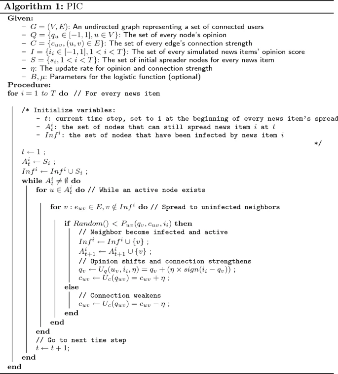

# IdeaPolarizationSimulator

## In one sentence describe what your program will do once completed.

This program will simulate the spread of polarized or oppositional ideas through a population based on existing 
mathematical models.

### Model:
 

## What language are you using and why?

I am using python for this project because I want to gain more experience with the language as well as leveraging 
existing tools like SimPy and pygame.
